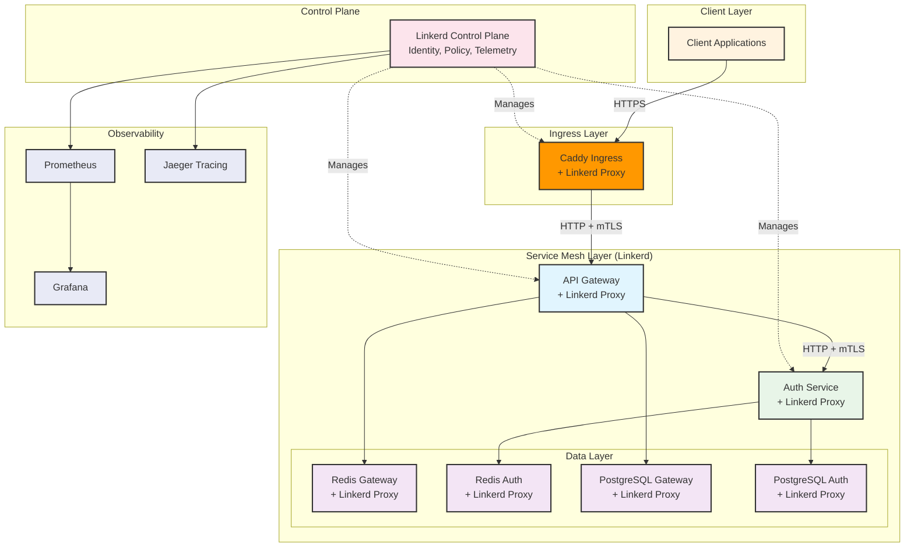

# Linkerd Service Mesh Integration

Complete integration of Linkerd service mesh with Munshi microservices architecture, providing automatic mTLS, observability, traffic management, and reliability features.

## 🔗 **Why Linkerd?**

Linkerd provides enterprise-grade service mesh capabilities that enhance our microservices architecture:

- **🔐 Automatic mTLS**: Zero-config mutual TLS between all services
- **📊 Observability**: Built-in metrics, distributed tracing, and service topology
- **🛡️ Security**: Identity-based authorization and encryption by default
- **⚡ Performance**: Ultra-light Rust-based proxy with minimal overhead
- **🔄 Reliability**: Circuit breaking, retries, timeouts, and load balancing
- **📈 Traffic Management**: Canary deployments, traffic splitting, and A/B testing

## 🏗️ **Architecture Overview**



## 🚀 **Quick Start**

### **Prerequisites**
- Kubernetes cluster (1.21+)
- kubectl configured
- Docker (for building images)

### **1. Install Linkerd**
```bash
# Run the installation script
./linkerd/linkerd-install.sh

# Verify installation
linkerd check
```

### **2. Deploy Munshi Services**
```bash
# Deploy to Kubernetes with Linkerd
./deploy.sh k8s production

# Check deployment status
./deploy.sh status
```

### **3. Access Services**
```bash
# Linkerd dashboard
linkerd viz dashboard

# Application
kubectl port-forward -n munshi svc/caddy-ingress 8443:443

# Jaeger tracing
linkerd jaeger dashboard
```

## 📦 **Deployment Options**

### **Option 1: Kubernetes with Linkerd (Recommended)**

**Full production deployment with automatic mTLS and observability:**

```bash
# Deploy everything
./deploy.sh k8s production

# Monitor services
linkerd viz stat deploy -n munshi
linkerd viz top deploy -n munshi
```

**Features:**
- ✅ Automatic mTLS between all services
- ✅ Service profiles for advanced traffic management
- ✅ Distributed tracing with Jaeger
- ✅ Prometheus metrics and Grafana dashboards
- ✅ Circuit breaking and retries
- ✅ Canary deployment support

### **Option 2: Docker Compose (Development)**

**Linkerd-compatible local development:**

```bash
# Development deployment
./deploy.sh docker development

# Access services
curl -k https://localhost/health
```

**Features:**
- ✅ Linkerd-ready service configuration
- ✅ Simulated service mesh headers
- ✅ Development observability stack
- ⚠️ No automatic mTLS (requires Kubernetes)

## 🔐 **Security Features**

### **Automatic mTLS**

Linkerd provides **zero-configuration mutual TLS** between all services:

```yaml
# Automatic mTLS is enabled by default
apiVersion: v1
kind: Namespace
metadata:
  name: munshi
  annotations:
    linkerd.io/inject: enabled  # Enables automatic mTLS
```

**Benefits:**
- 🔒 **End-to-end encryption** for all service communication
- 🆔 **Service identity** verification using X.509 certificates
- 🔄 **Automatic rotation** of certificates (24-hour TTL)
- 📊 **Zero performance impact** with efficient Rust proxy

### **Identity-Based Authorization**

```yaml
# Require authenticated connections
metadata:
  annotations:
    config.linkerd.io/proxy-require-identity-on-inbound-ports: "8001"
```

### **Service Identity Verification**

Application code automatically verifies service identity:

```python
# Auth service verifies requests from API Gateway
linkerd_service = request.headers.get("X-Linkerd-Service-Name")
if linkerd_service == "api-gateway":
    request.state.verified_client = True
```

## 📊 **Observability**

### **Built-in Metrics**

Linkerd automatically provides metrics for:
- **Success rates** and **latencies** (P50, P95, P99)
- **Request volumes** and **error rates**
- **Service topology** and **dependencies**

```bash
# View service metrics
linkerd viz stat deploy -n munshi

# Real-time traffic
linkerd viz top deploy -n munshi

# Service profile metrics
linkerd viz routes deploy/auth-service -n munshi
```

### **Distributed Tracing**

```bash
# Enable tracing
linkerd jaeger install | kubectl apply -f -

# View traces
linkerd jaeger dashboard
```

### **Grafana Dashboards**

Pre-configured dashboards for:
- **Service overview** and **health**
- **Request rates** and **latency percentiles**
- **Error rates** and **success rates**
- **Service mesh** and **proxy metrics**

```bash
# Access Grafana
linkerd viz dashboard
```

## 🛠️ **Service Profiles**

Advanced traffic management with service profiles:

```yaml
# auth-service profile
apiVersion: linkerd.io/v1alpha2
kind: ServiceProfile
metadata:
  name: auth-service.munshi.svc.cluster.local
spec:
  routes:
  - name: login
    condition:
      method: POST
      pathRegex: /auth/login
    timeout: 5s
    retryBudget:
      retryRatio: 0.1
      minRetriesPerSecond: 5
```

**Features:**
- ⏱️ **Per-route timeouts** and **retry policies**
- 📊 **Per-route metrics** and **success rates**
- 🔄 **Circuit breaking** and **load balancing**
- 📈 **Traffic splitting** for canary deployments

## 🔄 **Traffic Management**

### **Canary Deployments**

```yaml
# Traffic split for gradual rollouts
apiVersion: split.smi-spec.io/v1alpha1
kind: TrafficSplit
metadata:
  name: auth-service-canary
spec:
  service: auth-service
  backends:
  - service: auth-service-stable
    weight: 90
  - service: auth-service-canary
    weight: 10
```

### **Circuit Breaking**

Automatic failure detection and isolation:

```bash
# Monitor circuit breaker status
linkerd viz stat deploy -n munshi --from deploy/api-gateway
```

### **Load Balancing**

Linkerd provides intelligent load balancing:
- **Exponentially Weighted Moving Average (EWMA)**
- **Peak-EWMA** for latency-aware routing
- **Automatic endpoint discovery**

## 📈 **Performance**

### **Proxy Overhead**

Linkerd's Rust-based proxy adds minimal overhead:
- **Sub-millisecond P99 latency** added
- **~10MB memory** per proxy
- **~1-5% CPU overhead**

### **Optimized Configuration**

```yaml
# Proxy resource limits
annotations:
  config.linkerd.io/proxy-cpu-request: "10m"
  config.linkerd.io/proxy-memory-request: "20Mi"
  config.linkerd.io/proxy-cpu-limit: "100m"
  config.linkerd.io/proxy-memory-limit: "50Mi"
```

## 🔍 **Monitoring and Alerts**

### **Key Metrics to Monitor**

1. **Success Rate**: `sum(rate(response_total{classification="success"}[5m])) / sum(rate(response_total[5m]))`
2. **Latency P99**: `histogram_quantile(0.99, sum(rate(response_latency_ms_bucket[5m])) by (le))`
3. **Request Rate**: `sum(rate(response_total[5m])) by (dst_service_name)`
4. **Error Rate**: `sum(rate(response_total{classification="failure"}[5m]))`

### **Alerting Rules**

```yaml
# High error rate alert
- alert: LinkerdHighErrorRate
  expr: sum(rate(response_total{classification="failure"}[5m])) / sum(rate(response_total[5m])) > 0.1
  for: 1m
  labels:
    severity: warning
  annotations:
    summary: "High error rate detected"
```

## 🛠️ **Development Workflow**

### **Building and Testing**

```bash
# Build services
docker build -t munshi/auth-service:latest src/auth_service/
docker build -t munshi/api-gateway:latest src/api-gateway/

# Test with Linkerd
./deploy.sh k8s development
linkerd viz stat deploy -n munshi
```

### **Debugging**

```bash
# Check service mesh connectivity
linkerd viz edges deploy -n munshi

# View proxy logs
kubectl logs -n munshi deploy/auth-service -c linkerd-proxy

# Test mTLS connectivity
linkerd viz tap deploy/api-gateway -n munshi
```

### **Local Development**

```bash
# Use Linkerd-compatible Docker Compose
./deploy.sh docker development

# Test service communication
curl -k https://localhost/auth/login \
  -H "Content-Type: application/json" \
  -d '{"email":"test@example.com","password":"TestPass123"}'
```

## 🚨 **Troubleshooting**

### **Common Issues**

**1. Services not meshed**
```bash
# Check injection status
kubectl get pods -n munshi -o jsonpath='{.items[*].metadata.annotations.linkerd\.io/proxy-version}'

# Re-inject if needed
kubectl get deploy -n munshi -o yaml | linkerd inject - | kubectl apply -f -
```

**2. mTLS failures**
```bash
# Check identity
linkerd viz edges deploy -n munshi

# Verify certificates
linkerd identity --name auth-service.munshi.serviceaccount.identity.linkerd.cluster.local
```

**3. Performance issues**
```bash
# Check proxy resources
kubectl top pods -n munshi

# Review proxy configuration
kubectl describe pod -n munshi -l app=auth-service
```

## 📚 **Additional Resources**

- **Linkerd Documentation**: https://linkerd.io/docs/
- **Service Profiles**: https://linkerd.io/docs/service-profiles/
- **Troubleshooting Guide**: https://linkerd.io/docs/troubleshooting/
- **Best Practices**: https://linkerd.io/docs/best-practices/

## 🔮 **Future Enhancements**

- **Multi-cluster** service mesh with Linkerd
- **Advanced traffic policies** with Linkerd Policy Controller
- **Service Level Objectives (SLOs)** with automated alerting
- **Chaos engineering** integration with Linkerd
- **GitOps deployment** workflows with Flux/ArgoCD

This Linkerd integration provides enterprise-grade service mesh capabilities with minimal configuration and maximum security for the Munshi microservices architecture.