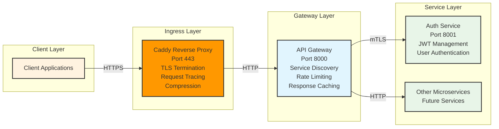

# Project Structure

This document outlines the complete structure of the Munshi microservices project.

## Root Directory

```
munshi/
├── README.md                           # Main project documentation
├── PROJECT_STRUCTURE.md               # This file - project structure guide
├── LINKERD.md                          # Linkerd service mesh integration guide
├── DEPLOYMENT.md                       # Comprehensive deployment guide
├── docker-compose.microservices.yml   # Traditional microservices deployment
├── docker-compose.linkerd.yml         # Linkerd-compatible development deployment
├── deploy.sh                           # Universal deployment script
├── k8s/                               # Kubernetes manifests with Linkerd
│   ├── namespace.yaml                 # Namespace with Linkerd injection
│   ├── auth-service.yaml             # Auth service with service mesh
│   ├── api-gateway.yaml              # API gateway with service mesh
│   ├── caddy-ingress.yaml            # Caddy ingress controller
│   ├── linkerd-service-profiles.yaml # Service profiles for traffic management
│   ├── monitoring.yaml               # Observability configuration
│   └── *.yaml                        # Database and Redis deployments
├── linkerd/                          # Linkerd installation and configuration
│   └── linkerd-install.sh            # Automated Linkerd installation
└── src/                              # Source code directory
    ├── auth_service/                 # Authentication microservice
    └── api-gateway/                  # API Gateway microservice
```

## Authentication Service (`src/auth_service/`)

```
src/auth_service/
├── __init__.py                  # Package initialization
├── main.py                      # FastAPI application and endpoints
├── models.py                    # SQLAlchemy and Pydantic models
├── database.py                  # Database configuration and session management
├── auth.py                      # Authentication utilities and password hashing
├── cache.py                     # Redis cache utilities and session management
├── config.py                    # Service configuration and settings
├── requirements.txt             # Python dependencies for auth service
├── .env.example                 # Environment variables template
├── Dockerfile                   # Docker image configuration
└── docker-compose.yml           # Standalone deployment configuration
```

### Authentication Service Features

- **Secure Authentication**: Server-side bcrypt password hashing with strong validation
- **JWT Token Management**: Stateless token-based authentication with Redis blacklisting
- **User Session Caching**: 1-hour Redis-cached session data for fast user lookups
- **Account Security**: Failed login tracking and automatic account lockout (5 attempts)
- **Token Blacklisting**: Instant logout with Redis-powered JWT invalidation
- **User Management**: Registration, login, logout, profile endpoints
- **Dedicated Database**: PostgreSQL on port 5433 (auth_db)
- **Dedicated Redis**: Redis on port 6380 (database 1) for security and session features
- **Independent Deployment**: Can be deployed separately from other services

## API Gateway Service (`src/api-gateway/`)

```
src/api-gateway/
├── __init__.py                  # Package initialization
├── main.py                      # FastAPI application and main routes
├── router.py                    # Request routing and service discovery
├── middleware.py                # Authentication, rate limiting, and caching middleware
├── cache.py                     # Redis cache utilities for performance and rate limiting
├── database.py                  # Database models and connection management
├── config.py                    # Gateway configuration and settings
├── requirements.txt             # Python dependencies for gateway
├── .env.example                 # Environment variables template
├── Dockerfile                   # Docker image configuration
├── docker-compose.yml           # Standalone deployment configuration
└── caddy/                       # Reverse proxy and TLS termination
    ├── Caddyfile                # Optimized Caddy configuration
    ├── Dockerfile               # Caddy container setup
    ├── README.md                # Caddy setup documentation
    ├── docker-entrypoint.sh     # Container initialization script
    └── generate-certs.sh        # TLS certificate generation
```

### API Gateway Features

- **Advanced Rate Limiting**: Redis-based sliding window algorithm (1000-5000 req/min)
- **Response Caching**: Intelligent GET request caching with configurable TTL
- **Service Discovery**: Dynamic service registration and health monitoring with Redis cache
- **Authentication Middleware**: JWT token validation with blacklist checking
- **Request Proxying**: Intelligent routing to backend microservices with connection pooling
- **Circuit Breaker**: Distributed failure state tracking in Redis
- **Enhanced Logging**: Request tracing with correlation IDs and timing information
- **Caddy Integration**: Optimized reverse proxy with TLS termination and compression
- **Dedicated Database**: PostgreSQL on port 5434 (gateway_db)
- **Dedicated Redis**: Redis on port 6381 (database 0) for performance and caching features

## Database Architecture

### Authentication Service Database (auth_db)
- **Port**: 5433
- **Tables**:
  - `users`: User accounts and authentication data
- **Redis Cache**: Port 6380 (database 1) for auth-specific features:
  - **Token Blacklist**: `blacklist:token:{token}` - Blacklisted JWT tokens
  - **User Sessions**: `session:user:{user_id}` - Cached user session data
  - **Failed Attempts**: `failed_attempts:{email}` - Login attempt counters
  - **Account Locks**: `account_locked:{email}` - Temporary account lockouts

### API Gateway Database (gateway_db)
- **Port**: 5434
- **Tables**:
  - `service_registry`: Registered microservices and health status
  - `request_logs`: HTTP request/response logging (optional)
- **Redis Cache**: Port 6381 (database 0) for performance features:
  - **Rate Limiting**: `rate_limit:{client_id}` - Sliding window rate counters (Redis sorted sets)
  - **Response Cache**: `response_cache:{hash}` - Cached GET responses with TTL
  - **Service Cache**: `service:{service_name}` - Service discovery information
  - **Circuit Breaker**: `circuit_breaker:{service}` - Service failure state tracking

## Service Communication



### Enhanced Authentication Flow
1. Client sends plaintext credentials over HTTPS: `POST /auth/login`
2. Auth service checks Redis cache for account lockout status
3. Auth service validates password with bcrypt and increments failed attempts if invalid
4. On successful auth, auth service caches user session and returns JWT token
5. Client includes JWT token in subsequent requests to gateway
6. Gateway validates token with auth service and checks Redis blacklist: `GET /auth/verify`
7. Gateway caches authentication results and forwards requests to backend services
8. On logout, JWT token is added to Redis blacklist: `POST /auth/logout`

### Redis Cache Integration
- **Authentication**: Token blacklist checking happens before JWT validation
- **Rate Limiting**: Sliding window counters track requests per client
- **Response Caching**: GET requests cached based on URL and headers
- **Session Management**: User data cached for 1 hour to reduce database load

## Security Features

### Password Security
- **HTTPS Transmission**: Passwords sent securely over TLS to auth service
- **Server-Side Hashing**: Bcrypt with salt rounds=12 for secure storage
- **Failed Attempt Tracking**: Redis-based sliding window tracking (15-min TTL)
- **Account Lockout**: Automatic 15-minute lockout after 5 failed attempts
- **Strong Validation**: Minimum 8 chars with uppercase, lowercase, and numbers

### Service Isolation
- **Separate Databases**: Each service has its own PostgreSQL database
- **Separate Configuration**: Independent environment variables and settings
- **Separate Deployment**: Services can be deployed and scaled independently

### Authentication
- **JWT Tokens**: Stateless authentication with configurable expiration
- **Token Blacklisting**: Redis-powered instant logout and token invalidation
- **Token Validation**: Centralized verification via auth service with blacklist checking
- **User Context**: User information injected into proxied requests
- **Session Caching**: 1-hour cached user sessions for improved performance

## Deployment Options

### 1. Kubernetes with Linkerd (Recommended)
```bash
./deploy.sh k8s production
```
- Automatic mTLS between all services
- Built-in observability and metrics
- Service profiles for traffic management
- Production-ready with high availability

### 2. Complete Microservices Deployment (Traditional)
```bash
docker-compose -f docker-compose.microservices.yml up -d
```
- Manual mTLS configuration
- Services communicate via Docker network
- Traditional microservices approach

### 3. Linkerd-Compatible Development
```bash
./deploy.sh docker development
```
- Linkerd-ready service configuration
- Enhanced observability stack
- Development-friendly setup

### 4. Independent Service Deployment

**Auth Service Only**:
```bash
cd src/auth_service
docker-compose up -d
```

**Gateway Only**:
```bash
cd src/api-gateway
docker-compose up -d
```

### 5. Development Setup
```bash
# Auth Service
cd src/auth_service
pip install -r requirements.txt
python -m uvicorn main:app --port 8001

# API Gateway
cd src/api-gateway
pip install -r requirements.txt
python -m uvicorn main:app --port 8000
```

## Environment Configuration

Each service uses environment variables for configuration:

### Auth Service Environment Variables
- `AUTH_DATABASE_URL`: PostgreSQL connection for auth database
- `AUTH_REDIS_URL`: Redis connection for auth service
- `JWT_SECRET_KEY`: Secret key for JWT token signing
- `ACCESS_TOKEN_EXPIRE_MINUTES`: Token expiration time

### Gateway Environment Variables
- `GATEWAY_DATABASE_URL`: PostgreSQL connection for gateway database
- `GATEWAY_REDIS_URL`: Redis connection for gateway service
- `AUTH_SERVICE_URL`: URL of the authentication service
- `RATE_LIMIT_REQUESTS`: Rate limiting configuration

## API Endpoints

### Authentication Service (Port 8001)
- `POST /auth/register` - Register new user with plaintext password over HTTPS
- `POST /auth/login` - Login with plaintext password over HTTPS (with rate limiting)
- `POST /auth/logout` - Logout user and blacklist JWT token (authenticated)
- `GET /auth/verify` - Verify JWT token with blacklist checking (used by gateway)
- `GET /auth/me` - Get current user information with session caching
- `GET /health` - Service health check

### API Gateway (Port 8000) via Caddy (Port 443)
- `GET /health` - Gateway health check (bypasses rate limiting)
- `GET /services` - List registered services (authenticated)
- `POST /services/{name}` - Register new service (authenticated)
- `DELETE /services/{name}` - Unregister service (authenticated)
- `* /auth/*` - Proxy to authentication service (Redis rate limited)
- `* /protected/{service}/*` - Proxy to services (authentication required, cached)

### Rate Limiting and Caching
- **Anonymous Users**: 1000 requests/minute
- **Authenticated Users**: 5000 requests/minute
- **GET Response Caching**: 5-10 minute TTL based on content type
- **Failed Login Protection**: 5 attempts per 15-minute window

## Monitoring and Observability

### Health Checks
- Each service provides `/health` endpoint
- Docker health checks configured for all containers
- Gateway monitors backend service health

### Logging
- Structured logging with request IDs
- Separate log files for each service
- HTTP access logs in gateway
- Error logs with stack traces

### Request Tracing
- Unique request IDs for each HTTP request
- Request/response timing
- User context in logs
- Cross-service request correlation

## Development Guidelines

### Adding New Services
1. Create new directory in `src/`
2. Follow the same structure as existing services
3. Add service configuration to gateway
4. Update docker-compose files
5. Document endpoints and configuration

### Security Considerations
- Never transmit plaintext passwords
- Always validate inputs
- Use prepared statements for database queries
- Implement proper CORS policies
- Use HTTPS in production
- Rotate JWT secrets regularly

### Testing
- Unit tests for business logic
-Integration tests for API endpoints
- End-to-end tests for authentication flow
- Load testing for performance validation
- Security testing for vulnerability assessment