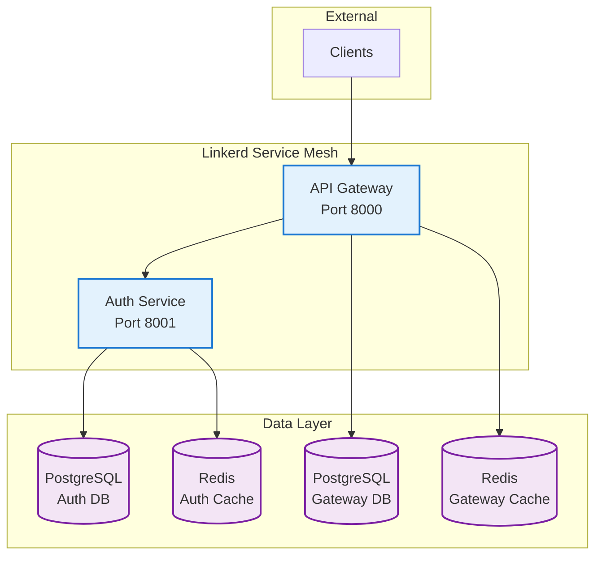

# Munshi Microservices

A modern, secure microservices platform with API Gateway and Authentication services. Features Linkerd service mesh, comprehensive testing, and universal Helm deployment.

## 🏗️ Architecture



### Key Features
- **Universal Deployment**: One script for all environments (Docker Desktop, cloud)
- **Service Mesh**: Linkerd for mTLS, observability, and reliability
- **Smart Configuration**: Auto-detects environment and adapts
- **Production Ready**: Security, monitoring, and performance optimized

## 🚀 Quick Start

### Prerequisites
- Docker Desktop with Kubernetes enabled
- Helm 3.8+
- Python 3.11+
- Poetry

### 1. Setup
```bash
# Clone and initialize
git clone <repository-url>
cd munshi
make install

# Deploy to current Kubernetes context
make deploy
```

That's it! The deployment script automatically:
- ✅ **Detects** your environment (Docker Desktop vs cloud)
- ✅ **Builds** images locally (if Docker Desktop)
- ✅ **Configures** appropriate values and namespace
- ✅ **Sets up** port forwarding (if local)

### 2. Access Services

**Local (Docker Desktop):**
- API Gateway: http://localhost:8000/docs
- Linkerd Dashboard: http://localhost:50750

**Cloud:**
- Check ingress: `make status`

## 🎯 Universal Deployment

The magic is in the single `deploy.sh` script that adapts to your environment:

```bash
# Works anywhere - auto-detects environment
make deploy

# Force specific environment if needed
ENVIRONMENT=staging make deploy
ENVIRONMENT=prod make deploy
```

### Environment Detection
| Context | Detected As | Namespace | Image Build |
|---------|-------------|-----------|-------------|
| `docker-desktop` | local | munshi-local | ✅ Auto |
| `*prod*` | prod | munshi-prod | ❌ CI/CD |
| `*staging*` | staging | munshi-staging | ❌ CI/CD |
| `*dev*` | dev | munshi-dev | ❌ CI/CD |

## 🛠️ Development

### Core Commands
```bash
make deploy          # Deploy to current k8s context
make status          # Check deployment status  
make logs            # View application logs
make clean           # Remove deployment

make test            # Run tests
make lint            # Check code style
make format          # Format code
```

### Development Workflow
```bash
# 1. Make changes to code
vim services/api-gateway/main.py

# 2. Redeploy (auto-rebuilds images if local)
make deploy

# 3. Check status
make status

# 4. View logs
make logs
```

## 📁 Project Structure

```
munshi/
├── scripts/
│   └── deploy.sh                    # Universal deployment script
├── infrastructure/
│   └── helm/munshi/                 # Helm charts with Linkerd
│       ├── Chart.yaml               # Dependencies (includes Linkerd)
│       ├── values.yaml              # Production defaults (all cloud)
│       ├── values-local.yaml        # Docker Desktop overrides
│       └── templates/               # Kubernetes manifests
├── services/
│   ├── api-gateway/                 # API Gateway service
│   ├── auth-service/                # Authentication service
│   └── shared/                      # Common libraries
└── tests/                           # Comprehensive testing
```

## ⚙️ Configuration

Configuration is environment-aware through Helm values:

### Local Development (`values-local.yaml`)
```yaml
environment: local
namespace: munshi-local
linkerd:
  enabled: true
  # Lightweight settings for local development
replicaCount:
  apiGateway: 1
  authService: 1
```

### Production (`values.yaml`)
```yaml
environment: production  
namespace: munshi-prod
linkerd:
  enabled: true
  viz:
    enabled: true
    grafana:
      enabled: true
replicaCount:
  apiGateway: 3
  authService: 2
```

## 🔐 Security Features

- **JWT Authentication** with token blacklisting
- **Rate Limiting** with sliding window algorithm  
- **mTLS Encryption** via Linkerd service mesh
- **Account Lockout** protection against brute force
- **Security Headers** and input validation

## 📊 Observability

### Linkerd Service Mesh
- **Automatic mTLS** between services
- **Traffic metrics** and golden signals
- **Success rates** and latency percentiles
- **Live traffic** tap and analysis

### Application Metrics
- Request/response metrics
- Authentication success/failure rates
- Database and cache performance
- Circuit breaker status

### Access Dashboards
```bash
# Linkerd observability dashboard
kubectl port-forward -n linkerd-viz svc/web 50750:8084
# Open: http://localhost:50750

# Check service mesh status
linkerd check
linkerd stat -n munshi-local
```

## 🚢 Cloud Deployment

### Push Images
```bash
# Build and push to GitHub Container Registry
make push GITHUB_USERNAME=myuser TAG=v1.2.3
```

### Deploy to Cloud
```bash
# Switch to your cloud cluster
kubectl config use-context my-prod-cluster

# Deploy (auto-detects as production environment)
make deploy
```

The deployment script automatically:
- ✅ **Detects** cloud environment from context
- ✅ **Uses** production values and settings
- ✅ **Skips** image building (expects images in registry)
- ✅ **Configures** ingress and external access

## 🧪 Testing

```bash
# Run all tests
make test

# Specific test types  
poetry run pytest tests/ -m "unit"
poetry run pytest tests/ -m "integration" 
poetry run pytest tests/ -m "e2e"
```

## 📚 Documentation

- [**Helm Chart Details**](infrastructure/helm/README.md)
- [**API Gateway Service**](services/api-gateway/README.md)
- [**Auth Service**](services/auth-service/README.md)
- [**Configuration Guide**](docs/CONFIGURATION.md)

## 🏆 Why This Architecture?

- ✅ **Simple**: One command deploys anywhere
- ✅ **Smart**: Auto-detects and adapts to environment  
- ✅ **Secure**: Service mesh mTLS and authentication
- ✅ **Observable**: Built-in metrics and tracing
- ✅ **Scalable**: Kubernetes-native with proper resource management
- ✅ **Maintainable**: Clean code structure with shared libraries

---

**Just run `make deploy` and everything works! 🚀**