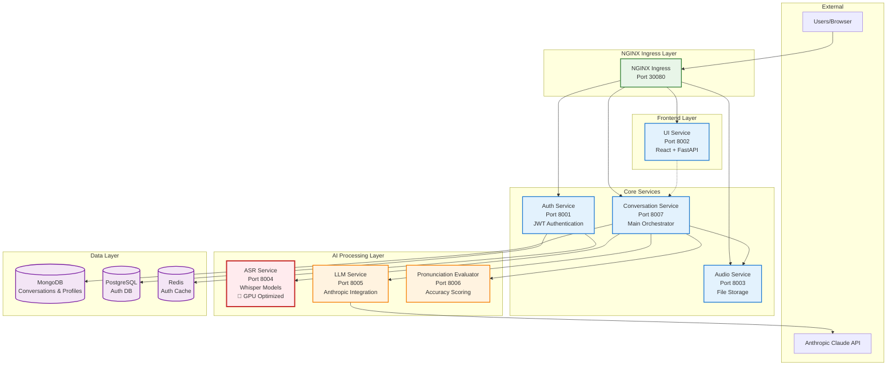
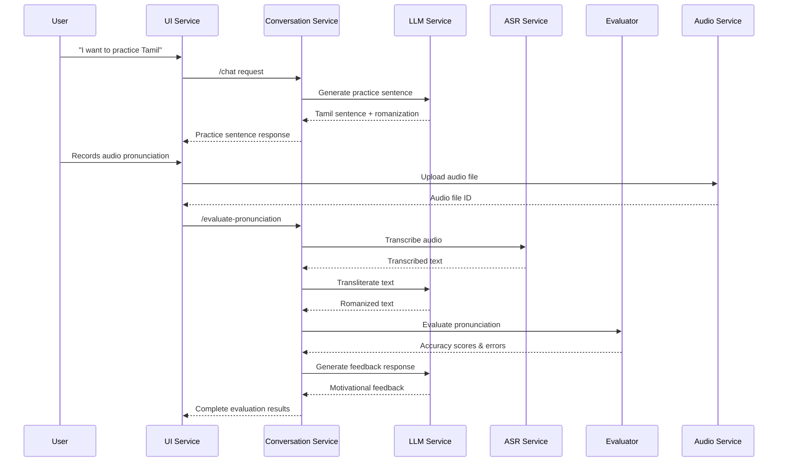

# Munshi AI Language Learning Platform

🎯 **AI-powered pronunciation training platform** with GPU-optimized speech recognition, LLM integration, and real-time evaluation.

## 🚀 Quick Deploy

```bash
# 1. Bootstrap (creates config files)
make bootstrap

# 2. Edit configuration  
# Edit infrastructure/terraform/terraform.tfvars with your GCP project and API keys

# 3. Deploy (5 minutes)
make deploy
```

**That's it!** Complete platform deployed with 54% cost savings via spot instances.

👉 **[Full Deployment Guide](DEPLOY.md)**

## 🏗️ Architecture



### 🌟 Key Features
- **🤖 AI-Powered Conversations**: Natural language interaction with Claude LLM
- **🎯 Real-time Pronunciation Evaluation**: Instant feedback with accuracy scoring
- **🚀 GPU-Optimized ASR**: Whisper models for multi-language speech recognition
- **💬 Conversational UI**: Modern React interface with real-time chat
- **🌐 Multi-language Support**: English, Tamil, Malayalam with romanization
- **🔄 Microservices Architecture**: Clean separation of concerns for scalability

## 🚀 Quick Start

### Prerequisites
- Docker Desktop with Kubernetes enabled
- Helm 3.8+
- Python 3.11+
- GPU nodes (for ASR service in production)
- Anthropic API key

### 1. Setup
```bash
# Clone and initialize
git clone <repository-url>
cd munshi
make install

# Set up secrets (required)
export ANTHROPIC_API_KEY="your-anthropic-api-key"

# Deploy to current Kubernetes context
make deploy
```

The deployment script automatically:
- ✅ **Builds** all service images locally for Docker Desktop
- ✅ **Configures** appropriate values and namespace
- ✅ **Sets up** NGINX ingress with service routing
- ✅ **Deploys** AI services (ASR, LLM, Evaluator, Conversation)

### 2. Access the Application

**Local (Docker Desktop):**
- **Munshi Chat**: http://localhost:30080
- **Health Checks**: http://localhost:30080/health

**Service Routing:**
- `/` → UI Service (React chat interface)
- `/api/conversation/` → Conversation Service (main orchestrator)
- `/api/audio/` → Audio Service (file storage)
- `/api/auth/` → Auth Service (authentication)
- Internal AI Services: ASR (8004), LLM (8005), Evaluator (8006)

## 🎯 User Experience Flow

### Conversational Learning
1. **Welcome**: Start conversation with Munshi AI
2. **Language Selection**: Choose English, Tamil, or Malayalam
3. **Practice Request**: "I want to practice pronunciation"
4. **Sentence Generation**: AI generates contextual practice sentences
5. **Voice Recording**: Record pronunciation attempt
6. **AI Evaluation**: Real-time accuracy scoring and feedback
7. **Continuous Learning**: Adaptive conversations based on progress

## 🛠️ Service Architecture

### Core Services

#### 🎯 **Conversation Service** (Port 8007)
- **Role**: Main orchestrator for all language learning workflows
- **Features**: User profiles, chat history, RAG preparation, service coordination
- **Database**: MongoDB for conversations and user learning analytics

#### 🚀 **ASR Service** (Port 8004) - GPU Optimized
- **Role**: Speech-to-text transcription using Whisper models
- **Features**: Multi-language support, model caching, GPU optimization
- **Models**: English (large-v2), Tamil (whisper-tamil-large-v2), Malayalam (whisper-medium-ml)

#### 🤖 **LLM Service** (Port 8005)
- **Role**: Anthropic Claude API integration for conversations and transliteration
- **Features**: Conversation generation, text transliteration, response generation
- **API**: Anthropic Claude 3 Sonnet

#### 📊 **Pronunciation Evaluator** (Port 8006)
- **Role**: Pronunciation accuracy scoring and error analysis
- **Features**: Word-level error detection, accuracy metrics, motivational feedback

#### 🎵 **Audio Service** (Port 8003)
- **Role**: Pure audio file storage and retrieval
- **Features**: Upload/download, metadata storage, file management

#### 🔐 **Auth Service** (Port 8001)
- **Role**: JWT-based authentication and user management
- **Features**: Login, registration, token management

#### 🎨 **UI Service** (Port 8002)
- **Role**: Modern React frontend with real-time chat interface
- **Features**: Conversational UI, pronunciation practice, progress tracking

### Deployment Commands

```bash
# Deploy everything
make deploy

# Check status
make status

# View logs for specific services
make logs SERVICE=conversation-service
make logs SERVICE=asr-service
make logs SERVICE=llm-service

# Quick development setup
make quick-dev

# Scale services
kubectl scale deployment conversation-service --replicas=3
```

### Environment Detection
| Context | Detected As | Namespace | Image Build | GPU Support |
|---------|-------------|-----------|-------------|-------------|
| `docker-desktop` | local | munshi-local | ✅ Auto | ❌ CPU fallback |
| `*prod*` | prod | munshi-prod | ❌ CI/CD | ✅ GPU nodes |
| `*staging*` | staging | munshi-staging | ❌ CI/CD | ✅ GPU nodes |

## 🛠️ Development

### Core Commands
```bash
make deploy          # Deploy to current k8s context
make status          # Check deployment status  
make logs            # View application logs
make clean           # Remove deployment

make test            # Run tests
make lint            # Check code style
```

### Development Workflow
```bash
# 1. Make changes to any service
vim services/conversation-service/main.py
vim services/ui-service/src/components/ChatInterface.jsx

# 2. Redeploy (auto-rebuilds images if local)
make deploy

# 3. Check status and logs
make status
make logs SERVICE=conversation-service

# 4. Test the application
curl http://localhost:30080/
curl http://localhost:30080/api/conversation/health
```

## 📁 Project Structure

```
munshi/
├── scripts/
│   └── deploy.sh                          # Universal deployment script
├── infrastructure/
│   └── helm/munshi/                       # Helm charts
│       ├── Chart.yaml                     # Chart metadata
│       ├── values.yaml                    # Production defaults
│       ├── values-local.yaml              # Docker Desktop overrides
│       ├── values-new-services.yaml       # New AI services config
│       └── templates/                     # Kubernetes manifests
│           ├── nginx-ingress.yaml         # NGINX ingress routing
│           ├── conversation-service.yaml  # Main orchestrator
│           ├── asr-service.yaml           # GPU-optimized ASR
│           ├── llm-service.yaml           # Anthropic integration
│           ├── pronunciation-evaluator.yaml
│           ├── audio-service.yaml         # File storage
│           ├── ui-service.yaml            # React frontend
│           └── auth-service.yaml          # Authentication
├── services/
│   ├── conversation-service/              # 🎯 Main orchestrator
│   ├── asr-service/                       # 🚀 Whisper ASR (GPU)
│   ├── llm-service/                       # 🤖 Anthropic Claude
│   ├── pronunciation-evaluator/           # 📊 Accuracy scoring
│   ├── audio-service/                     # 🎵 File storage
│   ├── ui-service/                        # 🎨 React frontend
│   ├── auth-service/                      # 🔐 Authentication
│   └── shared/                            # Common libraries
├── docs/
│   ├── architecture/                      # Architecture docs
│   └── contributing/                      # Contribution guidelines
└── tests/                                 # Comprehensive testing
    ├── integration/                       # Service integration tests
    └── e2e/                              # End-to-end user journeys
```

## ⚙️ Configuration

### Service Communication Flow



### NGINX Routing Configuration
The NGINX ingress handles all routing with intelligent path-based distribution:

```nginx
# Frontend (React SPA)
location / {
    proxy_pass http://ui_service;
    # SPA fallback for client-side routing
}

# Conversation API (Main orchestrator)
location /api/conversation/ {
    proxy_pass http://conversation_service;
    # WebSocket support for real-time features
}

# Audio file operations
location /api/audio/ {
    proxy_pass http://audio_service;
    # Optimized for file uploads/downloads
}

# Authentication
location /api/auth/ {
    proxy_pass http://auth_service;
    # Secure token handling
}
```

### Local Development (`values-local.yaml`)
```yaml
environment: local
namespace: munshi-local

# Minimal replicas for local development
asrService:
  replicas: 1
  resources:
    requests:
      cpu: "500m"  # CPU fallback, no GPU required
llmService:
  replicas: 1
conversationService:
  replicas: 1
pronunciationEvaluator:
  replicas: 1

ingress:
  type: NodePort
  nodePort: 30080
```

### Production (`values.yaml`)
```yaml
environment: production  
namespace: munshi-prod

# Scaled for production load
asrService:
  replicas: 2
  nodeSelector:
    accelerator: nvidia-tesla-t4  # GPU nodes
llmService:
  replicas: 3
conversationService:
  replicas: 5
pronunciationEvaluator:
  replicas: 3

ingress:
  type: LoadBalancer
```

## 🔐 Security Features

- **JWT Authentication** with secure token handling and refresh tokens
- **API Key Management** for external services (Anthropic) via Kubernetes secrets
- **NGINX Security Headers** (X-Frame-Options, CSP, HSTS, etc.)
- **Input Validation** and sanitization across all services
- **Network Policies** for service-to-service communication control
- **Non-root Containers** with read-only file systems where possible

## 🚀 Performance & Scalability

### GPU Optimization
- **ASR Service**: Whisper models optimized for NVIDIA GPUs
- **Model Caching**: Intelligent caching to avoid reloading large models
- **Batch Processing**: Efficient audio processing for multiple requests

### Service Scaling
- **Horizontal Pod Autoscaling** based on CPU/memory metrics
- **Load Balancing** across service replicas
- **Circuit Breakers** for fault tolerance
- **Connection Pooling** for database connections

### Caching Strategy
- **Redis** for authentication token caching
- **MongoDB** optimized queries for conversation history
- **Model Caching** in ASR service for performance
- **Static Asset Caching** via NGINX

## 🧪 AI Model Details

### Speech Recognition (ASR Service)
- **English**: OpenAI Whisper Large v2 (best accuracy)
- **Tamil**: Fine-tuned Whisper model for Tamil language
- **Malayalam**: Medium-sized Whisper optimized for Malayalam
- **Fallback**: Whisper Base model for unsupported languages

### Language Models (LLM Service)
- **Primary**: Anthropic Claude 3 Sonnet
- **Capabilities**: Conversation, transliteration, feedback generation
- **Context Window**: 200K tokens for extensive conversation history
- **Safety**: Built-in safety filters and content moderation

## 🧪 Testing

```bash
# Run all tests
make test

# Test specific services
pytest tests/integration/test_conversation_service.py
pytest tests/integration/test_asr_service.py
pytest tests/integration/test_llm_service.py
pytest tests/integration/test_auth_flow.py
pytest tests/e2e/test_pronunciation_journey.py
pytest tests/e2e/test_conversation_flow.py

# Load testing for AI services
pytest tests/load/test_asr_performance.py
pytest tests/load/test_conversation_scaling.py
```

## 📚 Documentation

- [**Service Architecture**](docs/architecture/SERVICES.md)
- [**Conversation Service**](services/conversation-service/README.md)
- [**ASR Service**](services/asr-service/README.md)
- [**LLM Service**](services/llm-service/README.md)
- [**Pronunciation Evaluator**](services/pronunciation-evaluator/README.md)
- [**Audio Service**](services/audio-service/README.md)
- [**UI Service**](services/ui-service/README.md)
- [**Auth Service**](services/auth-service/README.md)
- [**Configuration Guide**](docs/CONFIGURATION.md)
- [**Contributing Guide**](CONTRIBUTING.md)

## 🎯 Future Enhancements

### Planned Features
- 🧠 **RAG Integration**: Personalized learning content based on user progress
- 📱 **Mobile App**: React Native app with offline capabilities
- 🌍 **More Languages**: Support for Spanish, French, Hindi, and others
- 🎨 **Advanced UI**: Voice waveform visualization, lip-sync animation
- 📊 **Analytics Dashboard**: Detailed learning progress and insights

### AI Improvements
- 🔮 **GPT-4 Integration**: Alternative LLM provider for comparison
- 🎭 **Emotional AI**: Sentiment analysis for adaptive learning
- 🗣️ **Voice Cloning**: Personalized pronunciation examples
- 🎪 **Gamification**: AI-powered challenges and achievements

## 🏆 Why This Architecture?

### AI-First Benefits
- ✅ **Scalable AI Processing**: Independent scaling of GPU-intensive ASR vs CPU-intensive LLM
- ✅ **Model Flexibility**: Easy to swap or upgrade individual AI components
- ✅ **Cost Optimization**: GPU resources only where needed (ASR service)
- ✅ **Fault Isolation**: AI service failures don't affect core application

### Microservices Benefits
- ✅ **Service Independence**: Each service can be deployed and scaled independently
- ✅ **Technology Diversity**: Right tool for each job (Python for AI, React for UI)
- ✅ **Team Autonomy**: Different teams can own different services
- ✅ **Easier Testing**: Individual services can be tested in isolation

### Development Benefits
- ✅ **Clear Separation**: Well-defined service boundaries and responsibilities
- ✅ **Easy Debugging**: Request tracing across services with clear API contracts
- ✅ **Quick Deployment**: Single `make deploy` deploys entire stack
- ✅ **Local Development**: Works seamlessly on Docker Desktop

---

## 🚀 Get Started Now!

```bash
# 1. Set up your Anthropic API key
export ANTHROPIC_API_KEY="your-api-key-here"

# 2. Deploy the entire AI language learning platform
make deploy

# 3. Start learning! 
open http://localhost:30080
```

**Experience the future of AI-powered language learning! 🌟📚🗣️**