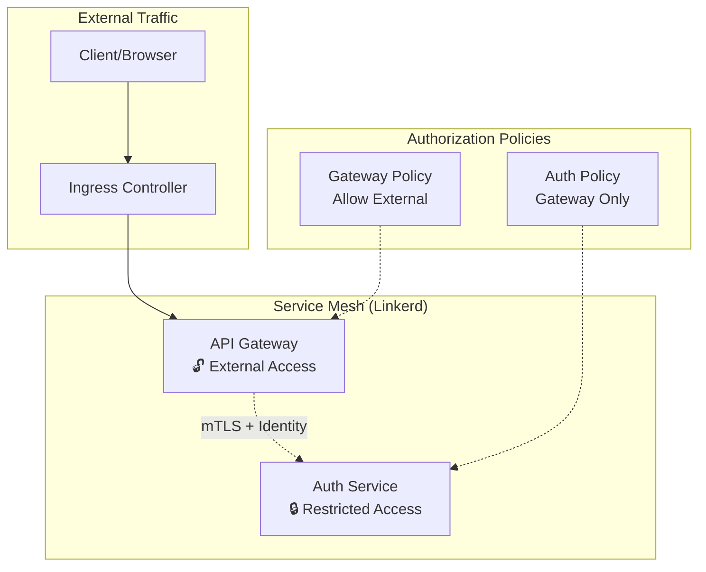

# Linkerd ServerAuthorization for Munshi Microservices

This document explains how Linkerd ServerAuthorization is implemented in the Munshi microservices architecture to provide secure service-to-service communication.

## 🔐 Authorization Architecture

### Overview
Linkerd ServerAuthorization provides:
- **Automatic mTLS** between all services
- **Identity-based authorization** using service accounts
- **Deny-by-default security** for sensitive services
- **Fine-grained route control** per HTTP endpoint
- **Zero-trust networking** within the service mesh

### Security Model



## 🛡️ Server Authorization Policies

### 1. Auth Service Policy (`auth-service-policy`)

**Purpose**: Restrict access to authentication endpoints

**Allowed Identities**:
- `api-gateway.munshi.serviceaccount.identity.linkerd.cluster.local`
- `linkerd-proxy.linkerd.serviceaccount.identity.linkerd.cluster.local` (health checks)

**Protected Endpoints**:
- `POST /auth/register`
- `POST /auth/login` 
- `GET /auth/verify`
- `GET /auth/me`
- `POST /auth/logout`
- `GET /health`

### 2. API Gateway Policy (`api-gateway-policy`)

**Purpose**: Allow external traffic while securing internal communication

**Access Pattern**:
- External traffic allowed (ingress)
- Internal service-to-service communication secured
- Health checks from monitoring systems

## 📋 Resource Definitions

### Server Resources
Define which pods and ports are protected:

```yaml
apiVersion: policy.linkerd.io/v1beta1
kind: Server
metadata:
  name: auth-service
  namespace: munshi
spec:
  podSelector:
    matchLabels:
      app: auth-service
  port: 8001
  proxyProtocol: "HTTP/2"
```

### ServerAuthorization
Define who can access the servers:

```yaml
apiVersion: policy.linkerd.io/v1beta1
kind: ServerAuthorization
metadata:
  name: auth-service-policy
  namespace: munshi
spec:
  server:
    name: auth-service
  requiredIdentities:
  - "api-gateway.munshi.serviceaccount.identity.linkerd.cluster.local"
```

### HTTPRoute
Define fine-grained route-level access:

```yaml
apiVersion: policy.linkerd.io/v1beta1
kind: HTTPRoute
metadata:
  name: auth-service-routes
  namespace: munshi
spec:
  parentRefs:
  - name: auth-service
    kind: Server
  rules:
  - matches:
    - path:
        type: Exact
        value: "/auth/login"
      method: POST
```

## 🔧 Configuration Changes

### Application Code Changes

#### Auth Service (`auth-service/main.py`)
```python
@app.middleware("http")
async def linkerd_identity_middleware(request: Request, call_next):
    """Extract Linkerd service identity for observability"""
    # Linkerd handles authorization - this is just for logging
    client_identity = request.headers.get("l5d-client-id", "unknown")
    
    if client_identity != "unknown":
        logging.info(f"Service-to-service call: {client_identity} -> auth-service")
    
    response = await call_next(request)
    response.headers["X-Service-Identity"] = client_identity
    return response
```

#### API Gateway (`api-gateway/main.py`)
```python
# Extract Linkerd service identity for observability
client_identity = request.headers.get("l5d-client-id", "external")

if client_identity != "external":
    logging.info(f"Service-to-service call: {client_identity} -> api-gateway")
```

### Kubernetes Deployment Changes

#### Auth Service Deployment
```yaml
metadata:
  annotations:
    linkerd.io/inject: enabled
    config.linkerd.io/default-inbound-policy: "deny"  # Deny by default
    config.linkerd.io/proxy-require-identity-on-inbound-ports: "8001"
```

#### API Gateway Deployment  
```yaml
metadata:
  annotations:
    linkerd.io/inject: enabled
    config.linkerd.io/default-inbound-policy: "allow-unauthenticated"  # Allow external
    config.linkerd.io/proxy-require-identity-on-inbound-ports: "8000"
```

## 🚀 Deployment

### 1. Deploy Authorization Policies
```bash
./infrastructure/kubernetes/linkerd/deploy-authorization.sh
```

### 2. Verify Policy Status
```bash
# Check policies
kubectl get serverauthorizations -n munshi
kubectl get servers -n munshi
kubectl get httproutes -n munshi

# Check policy enforcement
linkerd viz -n munshi
```

### 3. Test Authorization
```bash
# ✅ This should work (API Gateway -> Auth Service)
kubectl exec -n munshi deployment/api-gateway -- \
  curl http://auth-service:8001/health

# ❌ This should be blocked (direct access)
kubectl run test-pod --rm -i --tty --image=curlimages/curl -- \
  curl http://auth-service.munshi.svc.cluster.local:8001/health
```

## 📊 Monitoring & Observability

### Policy Enforcement Metrics
Linkerd provides metrics for policy enforcement:

```bash
# View authorization metrics
linkerd viz stat serverauthorizations -n munshi

# Monitor denied requests
linkerd viz top -n munshi --to auth-service
```

### Service Identity Verification
```bash
# Check service identities
linkerd viz edges -n munshi

# Verify mTLS status
linkerd viz stat deployments -n munshi -o wide
```

## 🔍 Troubleshooting

### Common Issues

#### 1. Authorization Denied
**Symptoms**: `403 Forbidden` or connection refused
**Causes**: 
- Missing ServerAuthorization policy
- Incorrect service identity
- Wrong namespace or labels

**Debug**:
```bash
# Check policy status
kubectl describe serverauthorization auth-service-policy -n munshi

# Check service identity
linkerd viz edges -n munshi --to auth-service
```

#### 2. Policy Not Applied
**Symptoms**: Policies exist but not enforced
**Causes**:
- Default inbound policy not set to "deny"
- Linkerd proxy not injected properly

**Debug**:
```bash
# Check proxy injection
kubectl get pods -n munshi -o yaml | grep linkerd.io/inject

# Check default policies
kubectl get deployments -n munshi -o yaml | grep default-inbound-policy
```

### Best Practices

#### 1. Principle of Least Privilege
- Start with `deny` by default
- Only allow necessary service-to-service communication
- Use specific route matching when possible

#### 2. Service Identity Management
- Use proper service accounts for each service
- Keep service identities descriptive and consistent
- Regular audit of service-to-service access patterns

#### 3. Testing
- Always test authorization policies in staging first
- Use monitoring to verify policy effectiveness
- Implement automated tests for authorization scenarios

## 📚 References

- [Linkerd ServerAuthorization Documentation](https://linkerd.io/2.14/features/server-policy/)
- [Linkerd HTTPRoute Documentation](https://linkerd.io/2.14/reference/authorization-policy/)
- [Zero Trust Networking with Linkerd](https://linkerd.io/2.14/features/zero-trust/)
- [Linkerd Identity and mTLS](https://linkerd.io/2.14/features/automatic-mtls/)