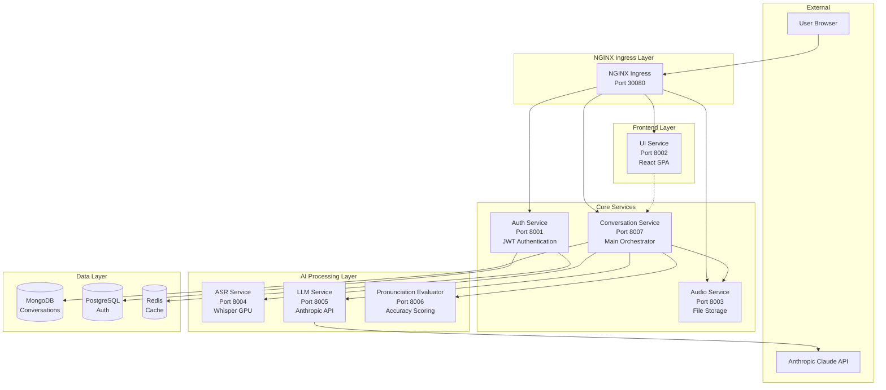

# Munshi AI Language Learning Platform - Project Structure

This document outlines the complete structure of the Munshi AI-powered language learning platform with advanced microservices architecture.

## Root Directory

```
munshi/
├── README.md                                   # Main project documentation
├── Makefile                                   # Development commands
├── .env.example                               # Environment variables template
├── .gitignore                                # Git ignore patterns
├── scripts/
│   └── deploy.sh                              # Universal deployment script
├── infrastructure/
│   └── helm/                                  # Helm charts for Kubernetes deployment
│       └── munshi/                            # Main Munshi chart
│           ├── Chart.yaml                     # Chart metadata
│           ├── values.yaml                    # Production defaults
│           ├── values-local.yaml              # Local development overrides
│           ├── values-new-services.yaml       # AI services configuration
│           └── templates/                     # Kubernetes resource templates
│               ├── conversation-service.yaml   # Main orchestrator
│               ├── asr-service.yaml           # GPU-optimized ASR
│               ├── llm-service.yaml           # Anthropic integration
│               ├── pronunciation-evaluator.yaml # Accuracy scoring
│               ├── audio-service.yaml         # File storage
│               ├── ui-service.yaml            # React frontend
│               ├── auth-service.yaml          # Authentication
│               ├── nginx-ingress.yaml         # NGINX ingress routing
│               └── secrets.yaml               # Kubernetes secrets
├── services/
│   ├── conversation-service/                  # 🎯 Main orchestrator
│   ├── asr-service/                          # 🚀 Whisper ASR (GPU)
│   ├── llm-service/                          # 🤖 Anthropic Claude
│   ├── pronunciation-evaluator/               # 📊 Accuracy scoring
│   ├── audio-service/                        # 🎵 File storage
│   ├── ui-service/                           # 🎨 React frontend
│   ├── auth-service/                         # 🔐 Authentication
│   └── shared/                               # Common libraries
├── tests/
│   ├── conftest.py                           # Test configuration
│   ├── e2e/                                  # End-to-end user journeys
│   ├── integration/                          # Service integration tests
│   └── load/                                 # Performance tests
└── docs/
    ├── architecture/                         # Architecture documentation
    └── contributing/                         # Contribution guidelines
```

## AI Services Overview

### 🎯 Conversation Service (`services/conversation-service/`)

Main orchestrator that coordinates all language learning workflows.

```
services/conversation-service/
├── main.py                      # FastAPI application
├── models.py                    # Pydantic data models
├── database.py                  # MongoDB configuration
├── requirements.txt             # Dependencies
├── Dockerfile                   # Docker build configuration
└── README.md                    # Service documentation
```

**Purpose**: Orchestrate conversations, manage user profiles, coordinate between AI services.
**Database**: MongoDB for conversation history and user learning analytics.
**Key Features**: Chat management, pronunciation evaluation workflow, RAG preparation.

### 🚀 ASR Service (`services/asr-service/`) - GPU Optimized

Speech recognition service using Whisper models.

```
services/asr-service/
├── main.py                      # FastAPI application
├── models.py                    # Request/response models
├── requirements.txt             # Dependencies (includes transformers, torch)
├── Dockerfile                   # Docker build with CUDA support
└── README.md                    # Service documentation
```

**Purpose**: Convert speech to text using pre-trained Whisper models.
**Models**: English (large-v2), Tamil (fine-tuned), Malayalam (medium).
**Key Features**: GPU optimization, model caching, multi-language support.

### 🤖 LLM Service (`services/llm-service/`)

Anthropic Claude API integration for conversation and transliteration.

```
services/llm-service/
├── main.py                      # FastAPI application
├── models.py                    # Request/response models
├── requirements.txt             # Dependencies (includes anthropic)
├── Dockerfile                   # Docker build configuration
└── README.md                    # Service documentation
```

**Purpose**: Generate conversations, transliterate text, provide feedback.
**API**: Anthropic Claude 3 Sonnet with 200K context window.
**Key Features**: Multi-endpoint design, conversation generation, transliteration.

### 📊 Pronunciation Evaluator (`services/pronunciation-evaluator/`)

Pronunciation accuracy scoring and error analysis.

```
services/pronunciation-evaluator/
├── main.py                      # FastAPI application
├── models.py                    # Evaluation models
├── requirements.txt             # Dependencies (includes jiwer)
├── Dockerfile                   # Docker build configuration
└── README.md                    # Service documentation
```

**Purpose**: Calculate pronunciation accuracy and provide detailed feedback.
**Key Features**: Word-level error analysis, accuracy metrics, motivational feedback.

### 🎵 Audio Service (`services/audio-service/`)

Pure audio file storage and retrieval service.

```
services/audio-service/
├── main.py                      # FastAPI application
├── models.py                    # Audio metadata models
├── database.py                  # MongoDB configuration
├── storage.py                   # File storage logic
├── requirements.txt             # Dependencies
├── Dockerfile                   # Docker build configuration
└── README.md                    # Service documentation
```

**Purpose**: Handle audio file upload, storage, and retrieval.
**Database**: MongoDB for metadata, file system for audio files.
**Key Features**: Upload/download endpoints, metadata management.

### 🎨 UI Service (`services/ui-service/`)

Modern React frontend with conversational interface.

```
services/ui-service/
├── server.py                    # FastAPI server for SPA
├── requirements.txt             # Python dependencies
├── Dockerfile                   # Docker build configuration
├── package.json                 # Node.js dependencies
├── vite.config.js              # Vite build configuration
├── src/                         # React application source
│   ├── App.jsx                 # Main application component
│   ├── components/             # React components
│   │   ├── ChatInterface.jsx   # Main chat interface
│   │   ├── AudioRecorder.jsx   # Audio recording component
│   │   ├── Login.jsx           # Authentication components
│   │   └── Register.jsx
│   ├── contexts/               # React contexts
│   │   └── AuthContext.jsx     # Authentication context
│   └── index.css               # Global styles with animations
├── dist/                        # Built assets
└── README.md                    # Service documentation
```

**Purpose**: Provide modern conversational UI for language learning.
**Technology**: React + Vite for fast development, FastAPI for serving.
**Key Features**: Real-time chat, pronunciation practice, progress tracking.

### 🔐 Authentication Service (`services/auth-service/`)

JWT-based authentication and user management.

```
services/auth-service/
├── main.py                      # FastAPI application
├── auth.py                      # Authentication logic
├── models.py                    # User data models
├── database.py                  # PostgreSQL configuration
├── requirements.txt             # Dependencies
├── Dockerfile                   # Docker build configuration
└── README.md                    # Service documentation
```

**Purpose**: Handle user login, registration, and JWT token management.
**Database**: PostgreSQL for user data, Redis for token caching.
**Key Features**: Secure authentication, token refresh, user management.

### Shared Components (`services/shared/`)

Minimal shared utilities across services.

```
services/shared/
├── auth/                        # Authentication utilities
│   ├── jwt_handler.py          # JWT token handling
│   └── middleware.py           # Auth middleware
├── config/                      # Configuration utilities
│   └── config_loader.py        # Config loading helpers
└── utils/                       # General utilities
    ├── helpers.py              # Helper functions
    └── validators.py           # Input validation
```

## Advanced AI Architecture

### Service Communication Flow



### Routing Logic

- **NGINX Ingress**: SSL termination, load balancing, and intelligent path-based routing (Port 30080)
  - `/` → UI Service (React SPA with client-side routing)
  - `/api/conversation/*` → Conversation Service (main orchestrator) 
  - `/api/audio/*` → Audio Service (file operations)
  - `/api/auth/*` → Auth Service (authentication)
  - Health checks distributed across services

### Service Orchestration

The **Conversation Service** acts as the main orchestrator:

1. **Text Conversations**: User → Conv → LLM → User
2. **Pronunciation Evaluation**: 
   - User audio → Audio Service (storage)
   - Conv → ASR Service (transcription)
   - Conv → LLM Service (transliteration) 
   - Conv → Evaluator (scoring)
   - Conv → LLM Service (feedback)
   - Results → User

### Deployment Architecture

- **Local Development**: Docker Desktop with CPU fallback for ASR
- **Production**: Kubernetes with GPU nodes for ASR service
- **Ingress**: NGINX for SSL termination and intelligent routing
- **Service Discovery**: Kubernetes DNS-based discovery
- **Secrets Management**: Kubernetes secrets for API keys and credentials

## Key Design Principles

1. **AI-First Architecture**: Services designed around AI processing capabilities
2. **Service Orchestration**: Clear orchestrator pattern with Conversation Service
3. **Single Responsibility**: Each service has one specific AI or infrastructure purpose
4. **Stateless Design**: Services are stateless for horizontal scaling (except data stores)
5. **GPU Optimization**: Dedicated GPU resources for computationally intensive AI tasks
6. **API-First**: All services communicate via well-defined REST APIs
7. **Fault Isolation**: AI service failures don't cascade to core application
8. **Environment Adaptability**: CPU fallback for local development, GPU for production

## Data Flow Patterns

### Conversational Learning Flow
```
User Input → UI → Conversation Service → LLM Service → Response
```

### Pronunciation Evaluation Flow
```
Audio Recording → Audio Service → Conversation Service → ASR Service → 
LLM Service (transliteration) → Evaluator Service → LLM Service (feedback) → 
Conversation Service → UI → User
```

### User Profile Management
```
User Actions → Conversation Service → MongoDB → Analytics & Progress Tracking
```

## Development Workflow

1. **Local Setup**: Use `make deploy` with automatic environment detection
2. **Service Development**: Each service can be developed and tested independently
3. **Integration Testing**: End-to-end tests verify complete AI workflows
4. **GPU Testing**: Local CPU fallback, production GPU validation
5. **Deployment**: Single Helm chart deploys entire AI platform

## Scalability Considerations

### Horizontal Scaling
- **UI Service**: Multiple replicas for web traffic
- **Conversation Service**: Main bottleneck, scale based on user load
- **LLM Service**: Scale based on conversation volume
- **ASR Service**: GPU-limited, scale with GPU availability
- **Evaluator Service**: CPU-bound, easily scalable

### Vertical Scaling
- **ASR Service**: Requires GPU memory for large Whisper models
- **LLM Service**: Network-bound to Anthropic API
- **Conversation Service**: Memory for orchestration state
- **Audio Service**: Storage I/O optimization

## Future Enhancements

- **RAG Integration**: Vector database for personalized learning content
- **Model Serving**: Custom model deployment for specialized tasks
- **Real-time Features**: WebSocket support for live conversation
- **Mobile Support**: API optimizations for mobile applications
- **Multi-tenancy**: Support for multiple organizations/schools
- **Advanced Analytics**: Learning progress insights and recommendations