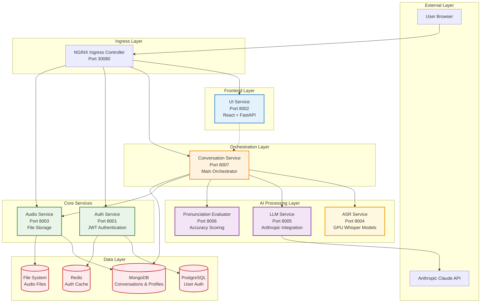

# Munshi AI Language Learning Platform - Service Architecture

This document provides a detailed overview of the service architecture for the Munshi AI-powered language learning platform.

## Architecture Overview

The Munshi platform follows a microservices architecture with clear separation between frontend, orchestration, AI processing, and data layers.



## Service Responsibilities

### 🎯 Conversation Service (Main Orchestrator)

**Port**: 8007  
**Role**: Central orchestrator for all language learning workflows  
**Technology**: FastAPI + MongoDB + HTTPx

#### Key Responsibilities:
- **User Management**: User profiles, learning progress, session tracking
- **Chat Orchestration**: Manage conversational flows with LLM integration
- **Pronunciation Workflows**: Coordinate complex pronunciation evaluation pipelines
- **Service Coordination**: Route requests between ASR, LLM, and Evaluator services
- **Context Management**: Maintain conversation history and user context
- **RAG Preparation**: Future integration with vector databases for personalized content

#### API Endpoints:
- `POST /chat` - Handle user conversations
- `POST /evaluate-pronunciation` - Orchestrate pronunciation evaluation workflow
- `GET /user/{user_id}/profile` - User learning profile management
- `GET /user/{user_id}/conversations` - Conversation history
- `POST /user/{user_id}/generate-sentence` - Generate practice sentences

#### Data Flow:
```
User Input → Conversation Service → LLM Service → Response
User Audio → Audio Service → Conversation Service → ASR → LLM → Evaluator → Response
```

### 🚀 ASR Service (GPU Optimized)

**Port**: 8004  
**Role**: Speech-to-text transcription using Whisper models  
**Technology**: FastAPI + Transformers + PyTorch + CUDA

#### Key Responsibilities:
- **Speech Recognition**: Convert audio to text using pre-trained Whisper models
- **Multi-language Support**: English, Tamil, Malayalam with specialized models
- **GPU Optimization**: Leverage NVIDIA GPUs for fast inference
- **Model Management**: Intelligent caching and loading of large models
- **Fallback Support**: CPU fallback for development environments

#### Supported Models:
- **English**: `openai/whisper-large-v2` (best accuracy)
- **Tamil**: `vasista22/whisper-tamil-large-v2` (fine-tuned)
- **Malayalam**: `thennal/whisper-medium-ml` (optimized)
- **Fallback**: `openai/whisper-base` (universal)

#### API Endpoints:
- `POST /transcribe` - Transcribe audio file to text
- `GET /supported-languages` - List supported languages and models
- `GET /health` - Service health check

#### Resource Requirements:
- **GPU**: NVIDIA Tesla T4 or better (production)
- **Memory**: 4GB GPU memory minimum
- **CPU**: Fallback support for development

### 🤖 LLM Service (Anthropic Integration)

**Port**: 8005  
**Role**: Language model integration for conversations and transliteration  
**Technology**: FastAPI + Anthropic SDK

#### Key Responsibilities:
- **Conversation Generation**: Create contextual conversations for language learning
- **Text Transliteration**: Convert Tamil/Malayalam to romanized English
- **Response Generation**: Generate motivational feedback based on pronunciation results
- **Sentence Generation**: Create practice sentences tailored to user level
- **Context Management**: Maintain conversation context with 200K token window

#### API Endpoints:
- `POST /conversation` - Generate conversation responses
- `POST /transliterate` - Transliterate text to romanized format
- `POST /generate-sentence` - Generate practice sentences
- `POST /generate-response` - Generate evaluation feedback
- `GET /health` - Service health check

#### Integration:
- **Primary Model**: Claude 3 Sonnet (claude-3-sonnet-20240229)
- **Context Window**: 200K tokens for extensive conversation history
- **Rate Limiting**: Built-in rate limiting and error handling
- **Safety**: Anthropic's built-in safety filters

### 📊 Pronunciation Evaluator

**Port**: 8006  
**Role**: Pronunciation accuracy scoring and detailed error analysis  
**Technology**: FastAPI + Jiwer + Difflib

#### Key Responsibilities:
- **Accuracy Calculation**: Calculate pronunciation accuracy percentages
- **Error Analysis**: Word-level pronunciation error detection
- **Metrics Generation**: WER (Word Error Rate) and CER (Character Error Rate)
- **Feedback Generation**: Motivational feedback messages
- **Comparison Logic**: Intelligent text normalization and comparison

#### API Endpoints:
- `POST /evaluate` - Evaluate pronunciation accuracy
- `GET /health` - Service health check

#### Evaluation Metrics:
- **Accuracy Percentage**: Overall similarity between intended and actual speech
- **Word Error Rate**: Percentage of words incorrectly pronounced
- **Character Error Rate**: Character-level error percentage
- **Error Types**: Mispronounced, missing, extra words

### 🎵 Audio Service (File Storage)

**Port**: 8003  
**Role**: Pure audio file storage and retrieval  
**Technology**: FastAPI + MongoDB + File System

#### Key Responsibilities:
- **File Upload**: Accept and store audio recordings
- **Metadata Management**: Store audio metadata in MongoDB
- **File Serving**: Efficient audio file retrieval
- **Format Support**: Multiple audio formats (WAV, MP3, OGG, WebM)
- **Storage Optimization**: Efficient file organization and cleanup

#### API Endpoints:
- `POST /audio/upload` - Upload audio files
- `GET /audio/play/{recording_id}` - Stream audio files
- `GET /audio/recordings/{user_id}` - List user recordings
- `DELETE /audio/recording/{recording_id}` - Delete recordings
- `GET /health` - Service health check

#### Storage Strategy:
- **File System**: Direct file storage for performance
- **MongoDB**: Metadata, file paths, user associations
- **Cleanup**: Automatic cleanup of orphaned files

### 🎨 UI Service (React Frontend)

**Port**: 8002  
**Role**: Modern React frontend with conversational interface  
**Technology**: React + Vite + FastAPI serving

#### Key Responsibilities:
- **User Interface**: Professional and fun conversational chat interface
- **Audio Recording**: Browser-based audio capture and playback
- **Real-time Chat**: Smooth conversation flows with typing indicators
- **Pronunciation Practice**: Integrated pronunciation training workflows
- **Progress Tracking**: Visual feedback and learning analytics
- **Responsive Design**: Mobile-friendly interface

#### Key Components:
- **ChatInterface**: Main conversational UI
- **AudioRecorder**: Audio capture with visual feedback
- **Login/Register**: Authentication flows
- **AuthContext**: User session management

#### Technology Stack:
- **Frontend**: React 18 + Vite for fast development
- **Styling**: Tailwind CSS with custom animations
- **Serving**: FastAPI backend for SPA serving
- **Build**: Optimized production builds

### 🔐 Auth Service (Authentication)

**Port**: 8001  
**Role**: JWT-based authentication and user management  
**Technology**: FastAPI + JWT + PostgreSQL + Redis

#### Key Responsibilities:
- **User Registration**: Secure user account creation
- **Authentication**: Login with JWT token generation
- **Token Management**: Token refresh and blacklisting
- **Session Management**: User session tracking
- **Security**: Password hashing, rate limiting, security headers

#### API Endpoints:
- `POST /auth/register` - User registration
- `POST /auth/login` - User login
- `POST /auth/refresh` - Token refresh
- `POST /auth/logout` - User logout
- `GET /auth/me` - Current user info
- `GET /health` - Service health check

#### Security Features:
- **Password Hashing**: BCrypt with salt
- **JWT Tokens**: Secure token generation with expiration
- **Redis Caching**: Token caching for performance
- **Rate Limiting**: Protection against brute force attacks

## Inter-Service Communication

### Service Discovery
- **Kubernetes DNS**: Services communicate via Kubernetes service names
- **Health Checks**: All services expose `/health` endpoints
- **Circuit Breakers**: Fault tolerance for external API calls

### Communication Patterns

#### Synchronous (REST)
- UI ↔ Conversation Service
- Conversation Service ↔ All AI Services
- All services ↔ Auth Service (token validation)

#### Asynchronous (Future)
- Message queues for heavy processing
- Event streaming for real-time features
- Batch processing for analytics

### Error Handling
- **Graceful Degradation**: Services continue with reduced functionality
- **Retry Logic**: Automatic retries with exponential backoff
- **Fallback Mechanisms**: CPU fallback for GPU services

## Data Architecture

### MongoDB (Conversations & Profiles)
- **Collections**: conversations, users, sessions
- **Indexes**: Optimized for conversation history queries
- **Scalability**: Horizontal scaling with sharding

### PostgreSQL (Authentication)
- **Tables**: users, tokens, sessions
- **ACID Compliance**: Ensuring data consistency
- **Backup Strategy**: Regular backups and point-in-time recovery

### Redis (Caching)
- **Use Cases**: Token caching, session storage
- **Performance**: Sub-millisecond response times
- **Persistence**: Optional persistence for critical data

### File System (Audio Storage)
- **Organization**: User-based directory structure
- **Cleanup**: Automated cleanup of old files
- **Backup**: Regular backup of audio files

## Scalability Considerations

### Horizontal Scaling
- **Stateless Services**: All services designed for horizontal scaling
- **Load Balancing**: NGINX handles load distribution
- **Auto-scaling**: Kubernetes HPA based on CPU/memory metrics

### Vertical Scaling
- **GPU Services**: ASR service requires vertical scaling for GPU memory
- **Memory-intensive**: LLM service for large context windows
- **I/O Intensive**: Audio service for file operations

### Performance Optimization
- **Model Caching**: ASR service caches loaded models
- **Connection Pooling**: Database connections optimized
- **CDN Integration**: Future CDN integration for static assets

## Security Architecture

### Network Security
- **Service Mesh**: Future Istio integration for mTLS
- **Network Policies**: Kubernetes network policies for traffic control
- **API Gateway**: NGINX as secure entry point

### Data Security
- **Encryption at Rest**: Database and file encryption
- **Encryption in Transit**: TLS for all service communication
- **Secrets Management**: Kubernetes secrets for sensitive data

### Access Control
- **RBAC**: Role-based access control
- **JWT Validation**: Token validation across services
- **Rate Limiting**: Protection against abuse

## Monitoring and Observability

### Health Monitoring
- **Health Checks**: Comprehensive health endpoints
- **Readiness Probes**: Kubernetes readiness validation
- **Liveness Probes**: Automatic restart on failures

### Metrics Collection
- **Prometheus**: Metrics collection and alerting
- **Grafana**: Visualization dashboards
- **Custom Metrics**: AI-specific metrics (accuracy, latency)

### Logging
- **Structured Logging**: JSON-formatted logs
- **Log Aggregation**: Future ELK stack integration
- **Distributed Tracing**: Request tracing across services

## Deployment Strategies

### Environment Management
- **Local Development**: Docker Desktop with CPU fallback
- **Staging**: Kubernetes with limited GPU resources
- **Production**: Full GPU cluster with auto-scaling

### Deployment Patterns
- **Blue-Green**: Zero-downtime deployments
- **Canary**: Gradual rollout of new versions
- **Feature Flags**: Runtime feature toggling

### Disaster Recovery
- **Multi-zone**: Deployment across availability zones
- **Backup Strategy**: Regular backups of all data stores
- **Recovery Testing**: Regular disaster recovery drills

This architecture provides a robust, scalable foundation for AI-powered language learning with clear separation of concerns and excellent fault tolerance.