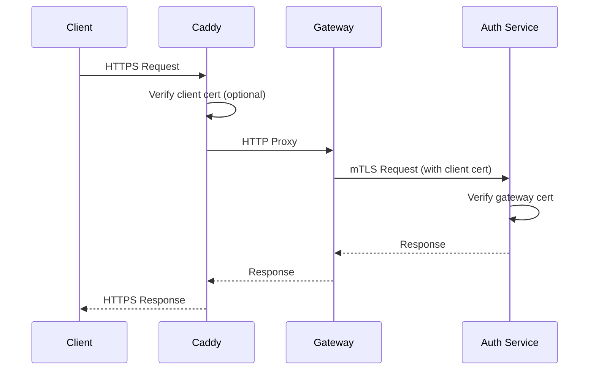

# Caddy Reverse Proxy with Redis Integration

A production-ready Caddy reverse proxy optimized for the Redis-powered API Gateway with HTTPS termination, mTLS support, and intelligent integration with gateway caching features.

## Architecture

```
Client (HTTPS) → Caddy Ingress (TLS) → API Gateway (Redis Cache) → Auth Service (mTLS + Redis)
```

This implements a secure, high-performance communication chain:
- **Client to Caddy**: TLS with client certificates (optional)
- **Caddy to Gateway**: Optimized HTTP with connection pooling for Redis operations
- **Gateway to Auth Service**: mTLS with client certificates and Redis cache coordination

## Enhanced Features with Redis Integration

- **HTTPS Termination**: Automatic HTTPS with internal CA and request correlation IDs
- **Redis-Aware Rate Limiting**: Emergency-only rate limiting (lets Redis handle sophisticated limits)
- **Security Headers**: HSTS, CSP, XSS protection optimized for cached responses
- **mTLS Support**: Mutual TLS with certificate generation for Redis-enabled services
- **Connection Optimization**: Enhanced pooling and keepalive for Redis-heavy workloads
- **Request Tracing**: Correlation IDs for Redis cache key generation and distributed tracing
- **Compression Optimization**: Efficient compression for Redis-cached responses

## Quick Start

### Development Setup with Redis

```bash
cd src/api-gateway
docker-compose up -d

# Services available at:
# - HTTPS with Redis integration: https://localhost
# - Admin API with Redis metrics: http://localhost:2019
# - Gateway Redis Cache: redis://localhost:6381/0
# - Auth Redis Cache: redis://localhost:6380/1
```

### Testing Redis-Integrated Setup

```bash
# Register user (HTTPS with Redis-powered rate limiting and session caching)
curl -k -X POST "https://localhost/auth/register" \
  -H "Content-Type: application/json" \
  -d '{
    "email": "test@example.com",
    "username": "testuser",
    "password": "TestPass123"
  }'

# Login (HTTPS with Redis session caching)
curl -k -X POST "https://localhost/auth/login" \
  -H "Content-Type: application/json" \
  -d '{
    "email": "test@example.com",
    "password": "TestPass123"
  }'

# Check health (bypasses Redis rate limiting)
curl -k https://localhost/health

# Test Redis cache headers
curl -k https://localhost/services -H "Authorization: Bearer <token>" -v | grep X-Cache

# Check rate limiting headers
curl -k https://localhost/auth/me -H "Authorization: Bearer <token>" -v | grep X-RateLimit
```

## Certificate Management

### Development (Automatic)

Caddy automatically generates certificates and handles mTLS setup:

```bash
# View generated certificates
docker exec caddy ls -la /etc/caddy/certs/

# Regenerate certificates
docker exec caddy /usr/local/bin/generate-certs.sh
```

### Production Setup

For production, configure with real domain names:

```caddyfile
your-domain.com {
    tls your-email@domain.com
    
    # ... rest of configuration
}
```

## mTLS Configuration

### Certificate Chain

The setup generates a complete certificate chain:

1. **CA Certificate** (`ca.crt`): Root authority for internal communication
2. **Gateway Certificate** (`gateway.crt`): Client certificate for API Gateway
3. **Auth Service Certificate** (`auth.crt`): Server certificate for Auth Service
4. **Client Certificate** (`client.crt`): Optional client certificate for external access

### Verification Process



## Redis-Optimized Rate Limiting

### Emergency Protection Only

Caddy now provides emergency-level protection while Redis handles sophisticated rate limiting:

```caddyfile
rate_limit {
    zone emergency_ddos {
        key {remote_host}
        events 1000    # High threshold - emergency protection only
        window 1m
    }
}
```

**Rate Limiting Strategy:**
- **Caddy Layer**: Emergency DDoS protection (1000 req/min)
- **Redis Layer**: Sophisticated sliding window rate limiting:
  - Anonymous users: 1000 requests/minute
  - Authenticated users: 5000 requests/minute
  - Failed login protection: 5 attempts per 15-minute window

### Benefits of Redis Integration

1. **No Rate Limiting Conflicts**: High Caddy thresholds don't interfere with Redis precision
2. **Sliding Window Algorithm**: Redis provides precise, fair rate limiting vs fixed windows
3. **User-Aware Limits**: Different limits for authenticated vs anonymous users
4. **Distributed Coordination**: Rate limits work across multiple gateway instances
5. **Performance**: Sub-millisecond Redis operations vs slower HTTP-based limits

## Security Headers

### Applied Headers

```http
Strict-Transport-Security: max-age=31536000; includeSubDomains; preload
X-XSS-Protection: 1; mode=block
X-Content-Type-Options: nosniff
X-Frame-Options: DENY
Content-Security-Policy: default-src 'self'; script-src 'self'; style-src 'self' 'unsafe-inline'
```

### Customizing Security

Modify headers in the Caddyfile:

```caddyfile
header {
    # Add custom headers
    X-API-Version "1.0"
    # Remove unwanted headers
    -Server
}
```

## Redis-Integrated Monitoring

### Admin API with Redis Metrics

Caddy's admin API now includes Redis-aware monitoring:

```bash
# View Redis-optimized configuration
curl http://localhost:2019/config/

# View metrics including Redis integration stats
curl http://localhost:2019/metrics

# Check Redis-related connection metrics
curl http://localhost:2019/metrics | grep -E "(redis|cache|rate_limit|connection)"

# Monitor connection pool efficiency for Redis operations
curl http://localhost:2019/metrics | grep caddy_reverse_proxy

# Reload configuration
curl -X POST http://localhost:2019/load \
  -H "Content-Type: application/json" \
  -d @new-config.json
```

### Redis-Aware Health Checks

Enhanced health checks that understand Redis integration:

```bash
# Check Caddy health with Redis metrics
curl http://localhost:2019/metrics

# Check service health through proxy (bypasses Redis rate limiting)
curl -k https://localhost/health

# Verify Redis cache integration
curl -k https://localhost/services -H "Authorization: Bearer <token>" -v | grep X-Cache

# Check connection pool health for Redis operations
curl http://localhost:2019/metrics | grep -E "(reused|keepalive|dial)"

# Monitor Redis rate limiting headers
curl -k https://localhost/auth/me -H "Authorization: Bearer <token>" -v | grep X-RateLimit
```

### Request Tracing and Logging

Caddy provides enhanced logging with Redis correlation:

```bash
# View container logs with Redis cache correlation
docker logs caddy

# Follow logs in real-time with request correlation
docker logs -f caddy

# Check request correlation IDs
curl -k https://localhost/health -v 2>&1 | grep X-Request-ID

# Monitor Redis cache operations via logs
docker logs api-gateway | grep "request_id\|cache"

# View Redis connection efficiency
docker logs caddy | grep -E "(dial|connect|reuse)"
```

## Troubleshooting

### Certificate Issues

```bash
# Check certificate validity
openssl x509 -in /etc/caddy/certs/ca.crt -noout -text

# Verify certificate chain
openssl verify -CAfile /etc/caddy/certs/ca.crt /etc/caddy/certs/gateway.crt
```

### mTLS Connection Issues

```bash
# Test mTLS connection
curl -v --cert /etc/caddy/certs/client.crt \
     --key /etc/caddy/certs/client.key \
     --cacert /etc/caddy/certs/ca.crt \
     https://auth-service:8001/health
```

### Redis Rate Limiting Issues

```bash
# Check emergency rate limit status (should rarely trigger)
curl -v -k https://localhost/auth/register

# Verify Redis rate limiting is active
curl -v -k https://localhost/services -H "Authorization: Bearer <token>" | grep X-RateLimit

# Expected Redis rate limit headers:
# X-RateLimit-Limit: 1000 (anonymous) or 5000 (authenticated)
# X-RateLimit-Remaining: <remaining_requests>
# X-RateLimit-Reset: <unix_timestamp>
# X-RateLimit-Window: 60
# X-RateLimit-Client: ip or user

# Test Redis cache functionality
curl -v -k https://localhost/services -H "Authorization: Bearer <token>" | grep X-Cache

# Expected cache headers:
# X-Cache: HIT or MISS
# X-Cache-Date: <cache_time> (for HIT)
# X-Cache-TTL: <seconds> (for MISS)
```

### Configuration Validation

```bash
# Validate Caddyfile
docker exec caddy caddy validate --config /etc/caddy/Caddyfile

# Check active configuration
curl http://localhost:2019/config/ | jq
```

## Redis-Optimized Performance Tuning

### Connection Optimization for Redis

Optimized for Redis-heavy workloads:

```caddyfile
{
    # Global options optimized for Redis integration
    auto_https off
    local_certs
    
    # Increased buffer sizes for Redis cached responses
    max_request_body_size 10MB
}
```

### Enhanced Connection Pooling for Redis Operations

Optimized for high-frequency Redis cache operations:

```caddyfile
:443 {
    # Enable HTTP/2 for multiple Redis cache lookups
    protocols h1 h2
    
    reverse_proxy api-gateway:8000 {
        # Optimized transport for Redis operations
        transport http {
            # Quick connection setup for Redis queries
            dial_timeout 5s
            response_header_timeout 30s
            
            # Enhanced connection pooling for Redis workloads
            keepalive 30s              # Longer keepalive for Redis connections
            keepalive_idle_conns 10    # Pool connections for Redis bursts
            max_conns_per_host 20      # Handle Redis operation spikes
        }
        
        # Request correlation headers for Redis cache keys
        header_up X-Real-IP {remote_host}
        header_up X-Forwarded-Proto {scheme}
        header_up X-Request-ID {uuid}
    }
}
```

### Redis-Aware Compression

```caddyfile
:443 {
    # Optimized compression for Redis cached responses
    encode {
        gzip {
            level 6     # Balanced compression for cached content
        }
        zstd {
            level 3     # Fast compression for Redis cache hits
        }
    }
    
    reverse_proxy api-gateway:8000
}
```

## Environment Variables

Configure behavior via environment variables:

```bash
# Certificate paths
CA_CERT_PATH=/etc/caddy/certs/ca.crt
CLIENT_CERT_PATH=/etc/caddy/certs/gateway.crt
CLIENT_KEY_PATH=/etc/caddy/certs/gateway.key

# Environment
ENVIRONMENT=production
DOMAIN=your-domain.com

# Rate limiting
RATE_LIMIT_GENERAL=100
RATE_LIMIT_AUTH=10
```

## Production Considerations

### Domain Configuration

Update Caddyfile for production domain:

```caddyfile
your-domain.com {
    tls your-email@domain.com
    # ... rest of configuration
}
```

### Certificate Management

For production, consider:

1. **Let's Encrypt**: Automatic certificate provisioning
2. **Custom CA**: Enterprise certificate authority
3. **Certificate rotation**: Automated certificate renewal

### Security Hardening

1. **Client Certificate Validation**: Require client certificates
2. **IP Whitelisting**: Restrict access by IP ranges
3. **DDoS Protection**: Implement additional rate limiting
4. **WAF Integration**: Web Application Firewall rules

## Redis Integration Summary

This optimized Caddy setup provides enterprise-grade reverse proxy capabilities specifically designed for Redis-powered microservices:

### **Key Redis Integration Benefits**

1. **Layered Rate Limiting**: Emergency protection at Caddy layer, sophisticated sliding window at Redis layer
2. **Connection Optimization**: Enhanced pooling and keepalive for Redis-heavy operations
3. **Request Correlation**: Unique request IDs for distributed tracing across Redis cache operations
4. **Cache Coordination**: Headers and compression optimized for Redis cached responses
5. **Performance Monitoring**: Redis-aware metrics and health checks
6. **High Availability**: Graceful degradation when Redis features are unavailable

### **Production Redis Deployment**

For production environments with Redis:

```caddyfile
your-domain.com {
    # Enhanced TLS for Redis environment
    tls your-email@domain.com
    
    # Redis-optimized headers
    header {
        Strict-Transport-Security "max-age=31536000; includeSubDomains; preload"
        Content-Security-Policy "default-src 'none'; connect-src 'self'"
        X-Request-ID {uuid}
        -Server
    }
    
    # Emergency-only rate limiting (Redis handles normal limits)
    rate_limit {
        zone emergency {
            key {remote_host}
            events 1000
            window 1m
        }
    }
    
    # Optimized reverse proxy for Redis operations
    reverse_proxy api-gateway:8000 {
        transport http {
            keepalive 60s
            keepalive_idle_conns 20
            max_conns_per_host 50
        }
        header_up X-Request-ID {uuid}
    }
}
```

This configuration provides optimal performance and reliability for Redis-integrated microservices while maintaining enterprise-grade security and monitoring capabilities.