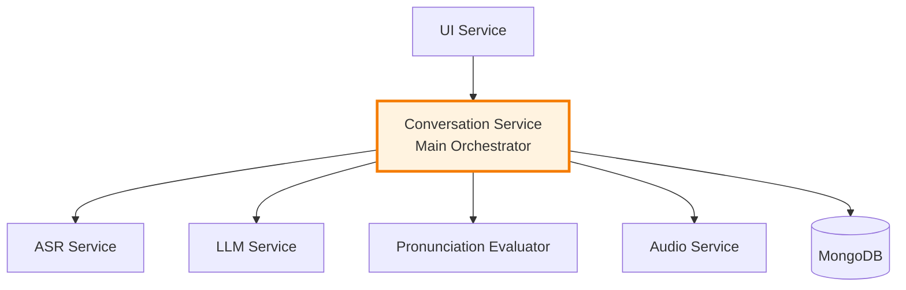

# Conversation Service - Main Orchestrator

The Conversation Service is the central orchestrator for the Munshi AI language learning platform. It coordinates all interactions between users and AI services while managing conversation state and user learning profiles.

## 🎯 Overview

This service acts as the main orchestrator that:
- Manages conversational flows between users and AI services
- Coordinates complex pronunciation evaluation workflows  
- Maintains user learning profiles and progress tracking
- Provides context management for personalized learning experiences
- Prepares for future RAG integration with learning content

## 🏗️ Architecture Role



## 🔄 Workflow Orchestration

### Text Conversation Flow
```
User Input → UI → Conversation Service → LLM Service → Response → User
```

### Pronunciation Evaluation Flow  
```
User Audio → Audio Service → Conversation Service → ASR Service → 
LLM Service (transliteration) → Evaluator Service → LLM Service (feedback) → 
Conversation Service → UI → User
```

## API Endpoints

### POST /chat
Handle text-based conversation with user.

**Request:**
```json
{
  "user_id": "user123",
  "message": "I want to learn Malayalam",
  "language": "Malayalam"
}
```

### POST /evaluate-pronunciation
Handle complete pronunciation evaluation workflow.

**Request:**
```json
{
  "user_id": "user123",
  "audio_file_id": "audio_id_from_audio_service",
  "intended_text": "എനിക്ക് മലയാളം ഇഷ്ടമാണ്",
  "language": "Malayalam"
}
```

### GET /user/{user_id}/profile
Get user learning profile and statistics.

### GET /user/{user_id}/conversations
Get user conversation history.

### POST /user/{user_id}/generate-sentence
Generate practice sentence for user.

### GET /health
Health check endpoint.

## Database Collections

- **conversations**: Chat messages and evaluation results
- **users**: User profiles and learning statistics
- **sessions**: Conversation sessions (future use)

## Service Dependencies

- **ASR Service** (port 8004): Speech transcription
- **LLM Service** (port 8005): Conversation and transliteration
- **Evaluator Service** (port 8006): Pronunciation evaluation
- **Audio Service** (port 8003): Audio file storage

## Environment Variables

- `CONVERSATION_SERVICE_PORT`: Service port (default: 8007)
- `MONGODB_URL`: MongoDB connection string
- `MONGODB_DATABASE`: Database name
- `ASR_SERVICE_URL`: ASR service URL
- `LLM_SERVICE_URL`: LLM service URL
- `EVALUATOR_SERVICE_URL`: Evaluator service URL
- `AUDIO_SERVICE_URL`: Audio service URL

## Future Enhancements

- RAG integration for personalized learning
- Advanced conversation flow management
- Learning analytics and insights
- Multi-session conversation tracking