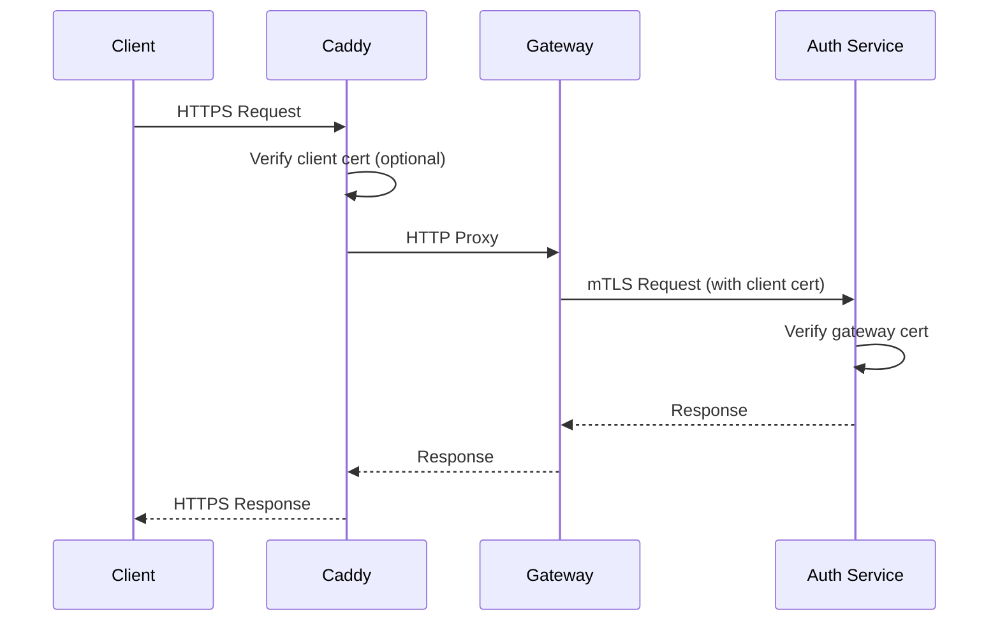

# Caddy Reverse Proxy with mTLS

A production-ready Caddy reverse proxy for the API Gateway with HTTPS termination and mTLS support for internal service communication.

## Architecture

```
Client (HTTPS) → Caddy Ingress (TLS) → API Gateway (mTLS) → Auth Service (mTLS)
```

This implements a secure communication chain:
- **Client to Caddy**: TLS with client certificates (optional)
- **Caddy to Gateway**: Internal HTTP (same container network)
- **Gateway to Auth Service**: mTLS with client certificates

## Features

- **HTTPS Termination**: Automatic HTTPS with internal CA for development
- **Rate Limiting**: Per-endpoint rate limiting (10 req/min for auth endpoints)
- **Security Headers**: HSTS, CSP, XSS protection, and more
- **mTLS Support**: Mutual TLS for internal service communication
- **Health Monitoring**: Built-in health checks and metrics
- **Zero-downtime Reloads**: Automatic configuration reloading

## Quick Start

### Development Setup

```bash
cd src/api-gateway
docker-compose up -d

# Services available at:
# - HTTPS: https://localhost
# - Admin API: http://localhost:2019
```

### Testing the Setup

```bash
# Register user (HTTPS with rate limiting)
curl -k -X POST "https://localhost/auth/register" \
  -H "Content-Type: application/json" \
  -d '{
    "email": "test@example.com",
    "username": "testuser",
    "password": "TestPass123"
  }'

# Login (HTTPS)
curl -k -X POST "https://localhost/auth/login" \
  -H "Content-Type: application/json" \
  -d '{
    "email": "test@example.com",
    "password": "TestPass123"
  }'

# Check health
curl -k https://localhost/health
```

## Certificate Management

### Development (Automatic)

Caddy automatically generates certificates and handles mTLS setup:

```bash
# View generated certificates
docker exec caddy ls -la /etc/caddy/certs/

# Regenerate certificates
docker exec caddy /usr/local/bin/generate-certs.sh
```

### Production Setup

For production, configure with real domain names:

```caddyfile
your-domain.com {
    tls your-email@domain.com
    
    # ... rest of configuration
}
```

## mTLS Configuration

### Certificate Chain

The setup generates a complete certificate chain:

1. **CA Certificate** (`ca.crt`): Root authority for internal communication
2. **Gateway Certificate** (`gateway.crt`): Client certificate for API Gateway
3. **Auth Service Certificate** (`auth.crt`): Server certificate for Auth Service
4. **Client Certificate** (`client.crt`): Optional client certificate for external access

### Verification Process



## Rate Limiting

### Configured Limits

```caddyfile
rate_limit {
    zone general {
        key {remote_host}
        events 100
        window 1m
    }
    zone auth {
        key {remote_host}
        events 10
        window 1m
    }
}
```

- **General endpoints**: 100 requests per minute per IP
- **Auth endpoints**: 10 requests per minute per IP (brute force protection)

### Customizing Limits

Update the Caddyfile to adjust rate limiting:

```caddyfile
handle /auth/* {
    rate_limit general auth  # Apply both zones
    # ... proxy configuration
}
```

## Security Headers

### Applied Headers

```http
Strict-Transport-Security: max-age=31536000; includeSubDomains; preload
X-XSS-Protection: 1; mode=block
X-Content-Type-Options: nosniff
X-Frame-Options: DENY
Content-Security-Policy: default-src 'self'; script-src 'self'; style-src 'self' 'unsafe-inline'
```

### Customizing Security

Modify headers in the Caddyfile:

```caddyfile
header {
    # Add custom headers
    X-API-Version "1.0"
    # Remove unwanted headers
    -Server
}
```

## Monitoring and Logging

### Admin API

Access Caddy's admin API for monitoring:

```bash
# View current configuration
curl http://localhost:2019/config/

# View metrics
curl http://localhost:2019/metrics

# Reload configuration
curl -X POST http://localhost:2019/load \
  -H "Content-Type: application/json" \
  -d @new-config.json
```

### Health Checks

Built-in health check endpoint:

```bash
# Check Caddy health
curl http://localhost:2019/metrics

# Check service health through proxy
curl -k https://localhost/health
```

### Request Logging

Caddy automatically logs requests. Access logs:

```bash
# View container logs
docker logs caddy

# Follow logs in real-time
docker logs -f caddy
```

## Troubleshooting

### Certificate Issues

```bash
# Check certificate validity
openssl x509 -in /etc/caddy/certs/ca.crt -noout -text

# Verify certificate chain
openssl verify -CAfile /etc/caddy/certs/ca.crt /etc/caddy/certs/gateway.crt
```

### mTLS Connection Issues

```bash
# Test mTLS connection
curl -v --cert /etc/caddy/certs/client.crt \
     --key /etc/caddy/certs/client.key \
     --cacert /etc/caddy/certs/ca.crt \
     https://auth-service:8001/health
```

### Rate Limiting Issues

```bash
# Check rate limit status
curl -v https://localhost/auth/register

# Look for rate limit headers
# X-RateLimit-Limit: 10
# X-RateLimit-Remaining: 9
```

### Configuration Validation

```bash
# Validate Caddyfile
docker exec caddy caddy validate --config /etc/caddy/Caddyfile

# Check active configuration
curl http://localhost:2019/config/ | jq
```

## Performance Tuning

### Buffer Sizes

For high-traffic scenarios, tune buffer sizes:

```caddyfile
{
    # Global options
    auto_https off
    local_certs
    
    # Increase buffer sizes
    max_request_body_size 10MB
}
```

### Connection Pooling

Enable HTTP/2 and connection reuse:

```caddyfile
:443 {
    # Enable HTTP/2
    protocols h1 h2
    
    reverse_proxy api-gateway:8000 {
        # Connection pooling
        transport http {
            dial_timeout 5s
            response_header_timeout 10s
        }
    }
}
```

## Environment Variables

Configure behavior via environment variables:

```bash
# Certificate paths
CA_CERT_PATH=/etc/caddy/certs/ca.crt
CLIENT_CERT_PATH=/etc/caddy/certs/gateway.crt
CLIENT_KEY_PATH=/etc/caddy/certs/gateway.key

# Environment
ENVIRONMENT=production
DOMAIN=your-domain.com

# Rate limiting
RATE_LIMIT_GENERAL=100
RATE_LIMIT_AUTH=10
```

## Production Considerations

### Domain Configuration

Update Caddyfile for production domain:

```caddyfile
your-domain.com {
    tls your-email@domain.com
    # ... rest of configuration
}
```

### Certificate Management

For production, consider:

1. **Let's Encrypt**: Automatic certificate provisioning
2. **Custom CA**: Enterprise certificate authority
3. **Certificate rotation**: Automated certificate renewal

### Security Hardening

1. **Client Certificate Validation**: Require client certificates
2. **IP Whitelisting**: Restrict access by IP ranges
3. **DDoS Protection**: Implement additional rate limiting
4. **WAF Integration**: Web Application Firewall rules

This Caddy setup provides enterprise-grade reverse proxy capabilities with strong security, monitoring, and scalability features.